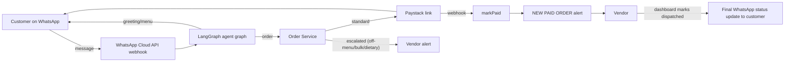

# ChopAgent 🤖🍽️

AI-agent WhatsApp food ordering for Nigerian vendors. Customers message a
WhatsApp bot to browse the menu and order in natural language; agents handle
standard orders, FAQ, and generate Paystack payment links. The human vendor is
only alerted for **paid orders** and **special/custom requests**.

## Architecture



Agents map to the PRD:

| Agent | Role | Vendor alert |
| --- | --- | --- |
| Greeting & Menu | Greets, shows menu, answers FAQ | — (autonomous) |
| Order Processing | Parses free text → cart, computes total, detects escalations | **Custom requests** |
| Payment | Paystack links, webhook verification, status update | **Payment success** |

## Stack

- **FastAPI** backend, **SQLAlchemy 2** + PostgreSQL
- **LangGraph** for the agent state graph (OpenAI `gpt-4o` does order parsing)
- **WhatsApp Cloud API** (inbound webhook + outbound text)
- **Paystack** for payments (initialized link + signed webhook)
- Vendor alerts over WhatsApp or a configurable webhook

## Getting started

```bash
cp .env.example .env          # add your WHATSAPP_TOKEN, OPENAI_API_KEY, PAYSTACK_SECRET_KEY
docker compose up -d db       # Postgres only (or point DATABASE_URL at a hosted DB)
python -m venv .venv && source .venv/bin/activate
pip install -e ".[dev]"
python -m app.seed            # creates demo vendor "Madam Grace Kitchen" + menu
uvicorn app.main:app --reload
```

### Webhook wiring

- **WhatsApp** → `GET/POST /api/v1/whatsapp/webhook`
  (verify with `WHATSAPP_VERIFY_TOKEN`)
- **Paystack** → `POST /api/v1/paystack/webhook`
  Events consumed: `charge.success`.

## API surface

| Method | Path | Purpose |
| --- | --- | --- |
| GET | `/api/v1/vendors/{id}/orders` | Dashboard order list (filter `?status=paid`) |
| PATCH | `/api/v1/vendors/{id}/orders/{oid}` | Set status; `dispatched` sends customer update |
| GET/POST | `/api/v1/vendors/{id}/menu` | Read / add menu items |
| PATCH | `/api/v1/vendors/{id}/menu/{item}/status` | Toggle **Sold Out** |

## Statuses

`pending → awaiting_vendor_review | awaiting_payment → paid → preparing → dispatched → delivered`

`payment_status: unpaid → pending → paid`

## Roadmap (out of Phase 1 scope)

Haulage/rider tracking, split payments for group orders, loyalty system.
SMS vendor alerts plug into `VendorAlertService._send_sms`.